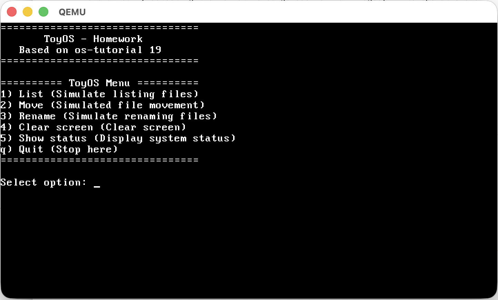
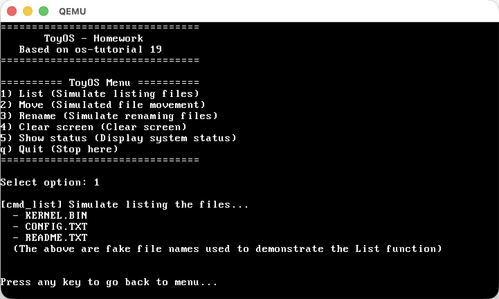
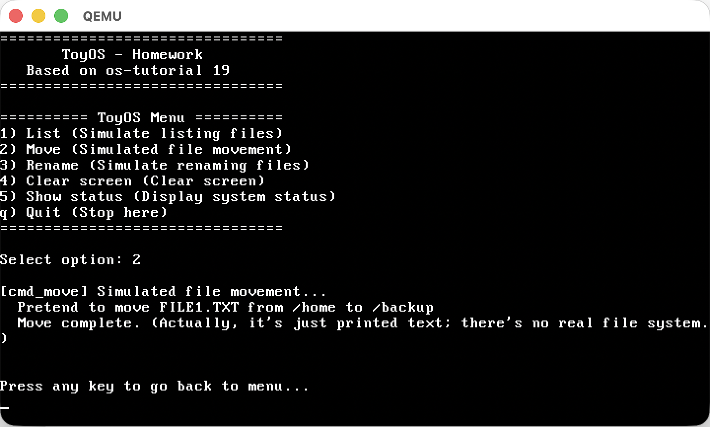
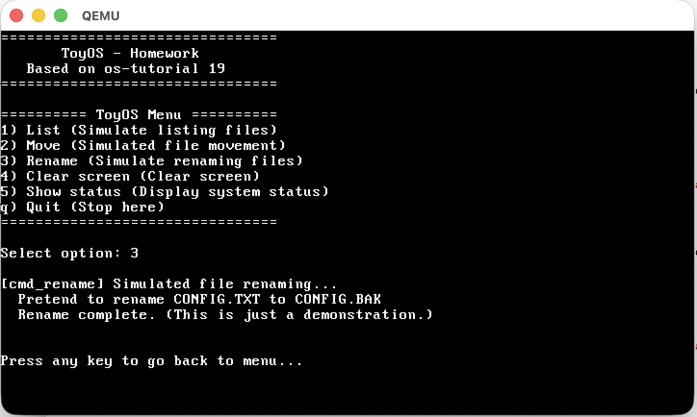
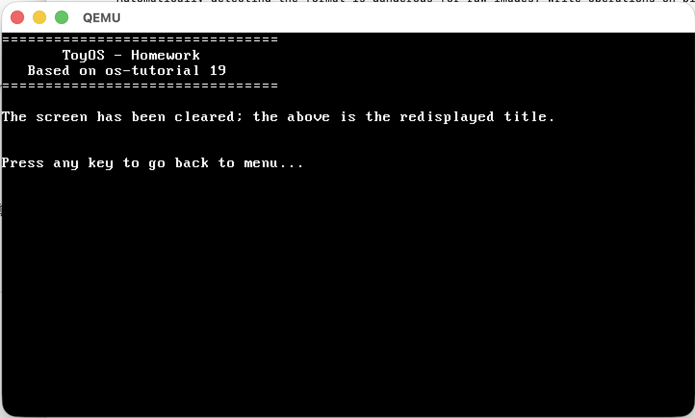
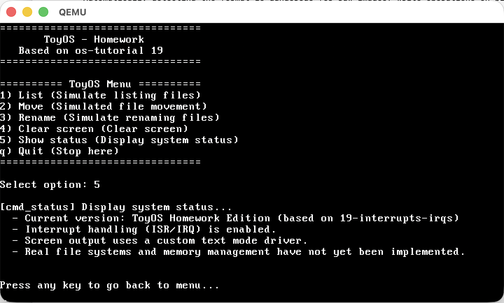
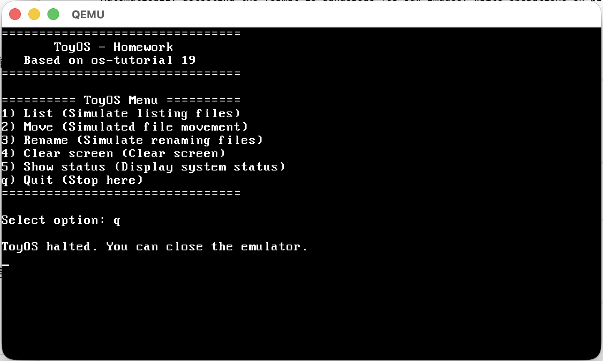

# ToyOS Homework

ToyOS Homework is a very small teaching operating system.  
It is based on lesson 19 of os-tutorial.  
The computer boots into a 32-bit kernel.  
Then it shows a text menu on the screen.  
The user can press one key to run a command: List / Move / Rename / Clear screen / Show status.

## Main Menu

**Figure 1** - ToyOS main menu after boot.

## Implemented Functions

### `cmd_list()`

- This function shows a fake file list.
- It prints file names, for example: `KERNEL.BIN`, `CONFIG.TXT`, `README.TXT`.

**Figure 2** - Result of command 1: `cmd_list()`.

### `cmd_move()`

- This function simulates moving a file.
- It prints a message that we move `FILE1.TXT` from `/home` to `/backup`.
- It is only text output. There is no real file system.

**Figure 3** - Result of command 2: `cmd_move()`.

### `cmd_rename()`

- This function simulates renaming a file.
- It prints a message that we rename `CONFIG.TXT` to `CONFIG.BAK`.

**Figure 4** - Result of command 3: `cmd_rename()`.

### `cmd_clear()`

- This function clears the screen.
- It calls `clear_screen()`, then prints the ToyOS title again.
- The screen looks like it is refreshed.

**Figure 5** - Screen after command 4: `cmd_clear()`.

### `cmd_status()`

- This function shows a simple system status:
  - ToyOS Homework Edition, based on lesson `19-interrupts-irqs`
  - Interrupt system (ISR/IRQ) is enabled
  - Output uses our own text-mode screen driver
  - Real file system and memory management are not implemented yet

**Figure 6** - Result of command 5: `cmd_status()`.

### `toyos_shell()`

- This is the main loop of the OS.
- It prints the title and the menu.
- It reads one key from the keyboard.
- It uses a `switch` to call the correct `cmd_*` function.

### `print_menu()`

- This function prints the main menu on the screen.
- The menu includes options `1`-`5` and `q` for quit.

## Quit Screen

**Figure 7** - Quit option: ToyOS halted screen.

## Total Lines of Code

Total lines of C code (kernel + basic drivers + CPU setup): about **523 lines**.  
This number includes comments and blank lines.
